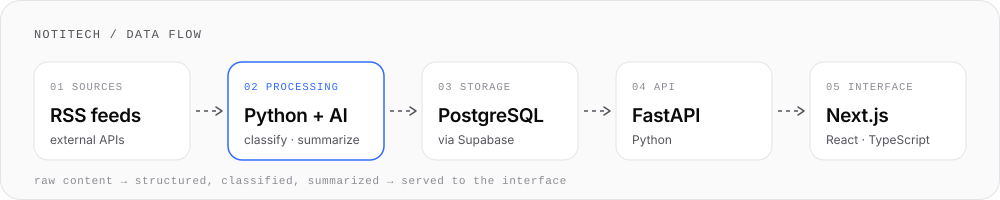

<picture>
  <source media="(prefers-color-scheme: dark)" srcset="assets/hero-dark.svg">
  
</picture>

Full-stack developer. I work across the whole path of a product: ingesting and structuring data, adding AI as a processing stage, exposing it through an API, and building the interface on top. TypeScript and React on one side, Python and PostgreSQL on the other.

I'm also completing a Higher Degree in Web Application Development (DAW).

## Currently building

### NotiTech

Technology content is spread across too many sources to follow. NotiTech is a tech radar: it collects content from multiple sources and uses AI to classify and summarize it, turning a raw stream into organized, readable information.

<picture>
  <source media="(prefers-color-scheme: dark)" srcset="assets/notitech-flow-dark.svg">
  
</picture>

- **Pipeline.** Ingestion, AI processing and storage happen before anything reaches the interface, so the API serves content that is already structured.
- **AI as a stage.** Classification and summarization are one step of the pipeline, and the results are stored in PostgreSQL through Supabase.
- **Separated services.** A FastAPI backend sits between the data and a Next.js / TypeScript frontend, with Docker for the environment.

Status: in active development.

## Other work

- **[DAWSCAPE](http://dawscape.fun)** (Laravel). A complete web application: a digital escape room for XTART students, played from a phone. Nine sequential challenges mix riddles, physical clue hunting, QR codes and interactive puzzles. It includes an admin panel, a real-time leaderboard made to be projected on a TV, personalized diplomas and a rating system, all under a terminal aesthetic.
- **Portfolio** (Next.js, TypeScript, Tailwind CSS). Personal site that presents my projects and work, built around a few Apple-inspired principles: generous space, strong hierarchy, subtle motion.

## Stack

What I use in projects today.

| Layer | In use |
| :-- | :-- |
| Interface | TypeScript, JavaScript, React, Next.js, Tailwind CSS |
| Backend | Python, FastAPI, Node.js, Laravel |
| Data | SQL, PostgreSQL, Supabase |
| Applied AI | Content classification and summarization (NotiTech) |
| Delivery | Docker, Git, GitHub |

## Exploring

Beyond what I use in projects today.

- **AI systems.** LLMs with embeddings and RAG to work over real data, and agents that can use tools.
- **Infrastructure.** Linux and deployment: running what I build, not only writing it.
- **Cybersecurity.** Where I want to specialize longer term.

## Contact

[LinkedIn](https://www.linkedin.com/in/yoseth-trejos) · [yosethtrejos16@gmail.com](mailto:yosethtrejos16@gmail.com)
